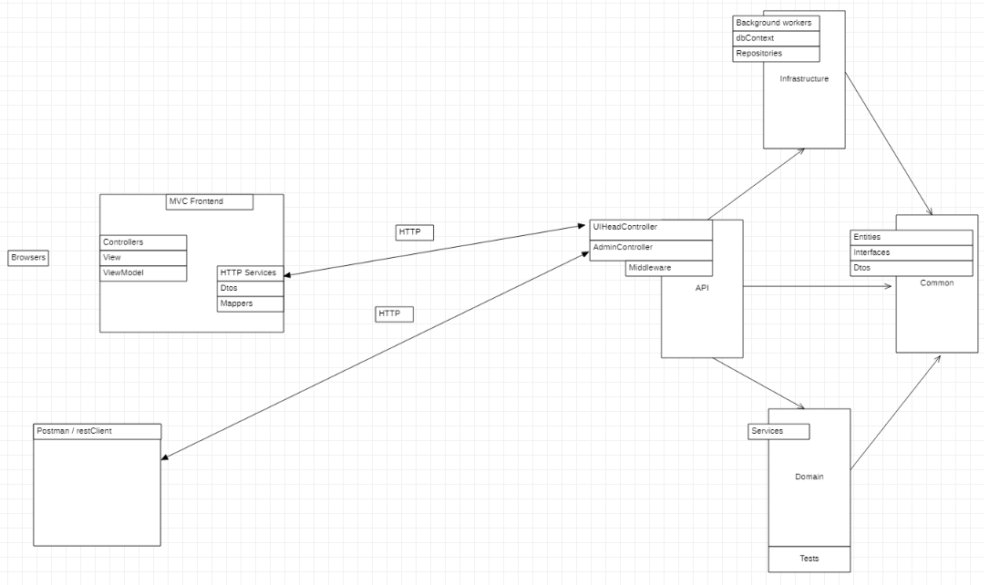
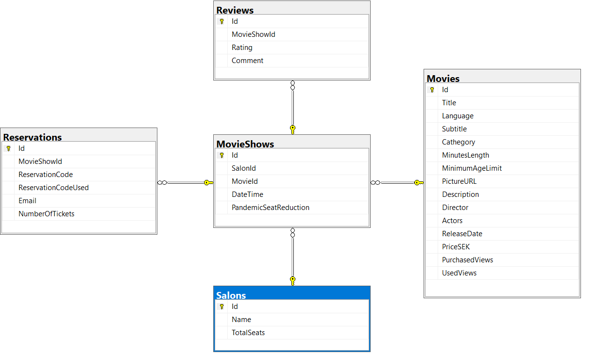
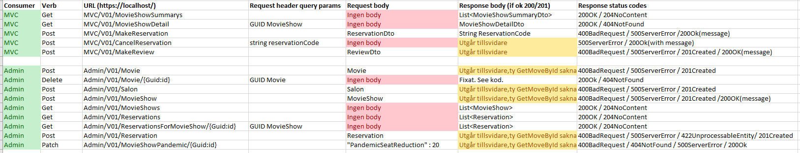
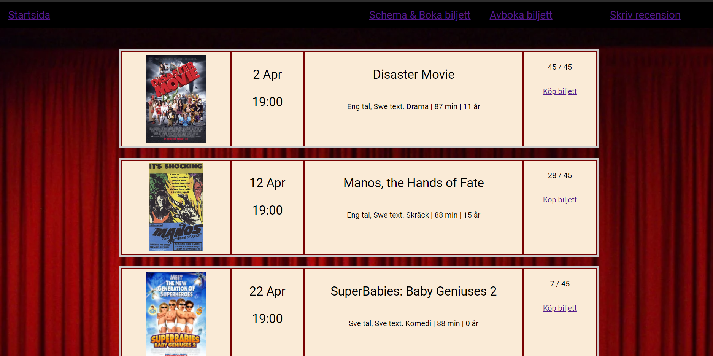
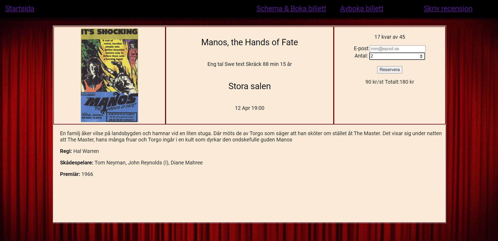

# BioTranan

Hyggligt nöjd med denna backend. Generic repository grejar jag med just nu.

Projektet är förberett för att hänga på en UI-Head i React när den kursen börjar, skall bli kul. Nuvarande UI-head är C#/MVC

